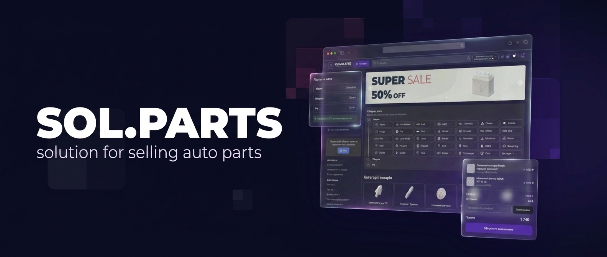

 

**Ecommerce platform for auto parts retailers.**
Catalog with vehicle fitment, supplier price feeds, order workflow, payments and delivery — out of the box.

---

## About

Selling auto parts online is not a generic ecommerce problem. Hundreds of thousands of SKUs, cross-references between brands, applicability by vehicle and category, and stock spread across supplier warehouses — all of it has to work on every page load.

Our team has spent **10+ years** building exactly this. Sol.parts is the platform that came out of it, now running **70+ stores** across Ukraine.

> *“Experience is 90% of success.”*

## What the platform handles

| | |
| :-- | :-- |
| **Catalog & fitment** | Large nomenclature, cross-references between brands, applicability by vehicle and by category |
| **Supplier price lists** | Automated imports over email, FTP and API — sell from supplier warehouses without manual uploads |
| **Order workflow** | Configurable statuses, splitting and merging, reservations, automated stage transitions |
| **Payments** | LiqPay, plata by mono, NovaPay, RozetkaPay, Portmone, WayForPay, Hutko — plus monobank / PrivatBank installments and Checkbox fiscal receipts (ПРРО) |
| **Delivery** | Nova Poshta integration — waybills, tracking and shipment documents |
| **ERP & accounting** | Odoo and Dilovod integrations, plus an open API for in-house ERP/CRM systems |
| **Marketing & SEO** | SEO module, Google Merchant feed, Google Shopping and Performance Max support |

## Tech stack

Full breakdown: [sol.parts/tekhnichnyi-stek](https://sol.parts/tekhnichnyi-stek)

## Open source

Pieces of our stack that are useful outside of it, released under MIT:

| Repository | What it does |
| :-- | :-- |
| [**symfony-smsfly-notifier**](https://github.com/sol-parts/symfony-smsfly-notifier) | Symfony Notifier bridge for the SMS-fly gateway — SMS and Viber |
| [**symfony-smsclub-notifier**](https://github.com/sol-parts/symfony-smsclub-notifier) | Symfony Notifier bridge for the SmsClub gateway |
| [**symfony-alphasms-notifier**](https://github.com/sol-parts/symfony-alphasms-notifier) | Symfony Notifier bridge for AlphaSMS — Viber with SMS fallback, balance checks and delivery webhooks |
| [**symfony-turbosms-notifier**](https://github.com/sol-parts/symfony-turbosms-notifier) | Symfony Notifier bridge for TurboSMS — SMS and hybrid Viber over the HTTP JSON API |
| [**payum-contracts**](https://github.com/sol-parts/payum-contracts) | Request primitives and narrow ports shared between a Payum host application and gateway packages |
| [**payum-privatbank-payparts**](https://github.com/sol-parts/payum-privatbank-payparts) | Payum gateway for PrivatBank PayParts installments, built on the payparts v2 API |
| [**payum-liqpay**](https://github.com/sol-parts/payum-liqpay) | Payum gateway for LiqPay — hosted checkout redirect and embedded widget, with two-stage payments |
| [**payum-monobank**](https://github.com/sol-parts/payum-monobank) | Payum gateway for monobank acquiring (plata by mono) — hosted checkout, two-stage hold payments and signed webhooks |
| [**payum-monobank-chast**](https://github.com/sol-parts/payum-monobank-chast) | Payum gateway for monobank Chast hire purchase — in-app confirmation and store-side settlement |
| [**payum-novapay**](https://github.com/sol-parts/payum-novapay) | Payum gateway for NovaPay eCommerce acquiring — hosted checkout, hold payments and refunds |
| [**payum-hutko**](https://github.com/sol-parts/payum-hutko) | Payum gateway for Hutko acquiring on the Fondy-compatible protocol — hosted checkout and preauth holds |
| [**payum-rozetkapay**](https://github.com/sol-parts/payum-rozetkapay) | Payum gateway for RozetkaPay acquiring — hosted checkout, hold payments and refunds |
| [**sol-stimulus-components**](https://github.com/sol-parts/sol-stimulus-components) | Stimulus controllers with no build step: swipe gestures and a dependency-light slideshow, published on npm |
| [**server-baseline**](https://github.com/sol-parts/server-baseline) | Ansible role and server requirements for running a store on your own server |

Issues and pull requests are welcome.

## What we do

| Service | |
| :-- | :-- |
| [Store development](https://sol.parts/development-auto-parts-store) | Launch on the platform, tailored to your assortment and suppliers |
| [Platform updates](https://sol.parts/update-auto-parts-store) | Continuous development — new features every month |
| [Technical assistance](https://sol.parts/tehnichna-dopomoga) | Diagnostics, migrations, one-off engineering work |
| [Managed server](https://sol.parts/kerovaniy-server) | Hosting, monitoring, backups and updates handled for you |
| [Advertising support](https://sol.parts/suprovid-reklamy) | Google Shopping and Performance Max campaign management |

## Get in touch

Built in Ukraine 🇺🇦 · <a href="https://sol.parts/">sol.parts</a>

